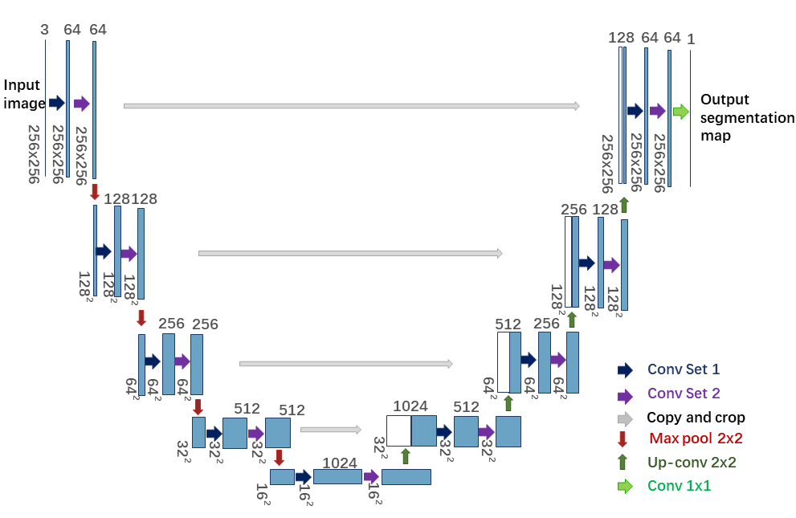
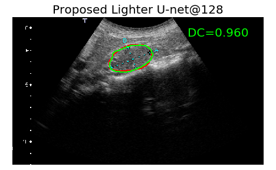
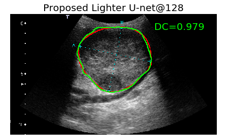

Light U-net for lesion segmentation in ultrasound images.
=================

## The repository includes two subfolders: 
- code: Light U-net and Lighter U-net@C code for ultrasound image segmentation.
- pretrained_models: pretrained models on the ultrasound image dataset from [5].


## 1.Code for Light U-net and Lighter U-net@C.

### 1.1 Models architecture:

The general network architecture of U-net, Light U-net and Lighter U-net@C is shown as below, the differences lies in the definition of “Conv set 1” and “Conv set 2”.

<div align=center></div>


- **U-net:** “Conv set 1” and “Conv set 2” correspond to regular 3 x 3 convolutions.

- **Light U-net:** “Conv set 1” corresponds to regular 3 x 3 convolution while “Conv set 2” corresponds to depthwise separable convolution (C = 1).

- **Lighter U-net @C:** Both “Conv set 1” and “Conv set 2” correspond to intermediate modules with parameter C, where C \in {1; 2; 4; 8; 16; 32; 64; 128} and C = 1 represents depthwise separable convolutions. For the first layer with 3 channels, set C to 3 (except when C = 1). For other layers, choose the minimum value of C and the input channel
number to implement the intermediate modules.

Note that both “Conv set 1” and “Conv set 2” are applied with Batch Normalization and ReLU activation function.


### 2.2 Usage of the code:

Set the hyperparameters in "parser_args.py" file, which includes the selected model, the data path, the image foler and et al., then run the following code to train the model and predict the segmentation.

**Train the model:** 

```python train.py```

**Predict:** 

```python predict.py```


## 2. Pretrained models:

### 2.1 Dataset used for training the networks:

The dataset follows the standardization of dynamic contrast-enhanced ultrasound (DCE-US) which is used for predicting outcomes of antiangiogenic therapy for solid
tumors. More details can be found in [5, 6]. We only had access to part of the complete dataset in [5, 6], which corresponds to 348 patients from the original 539 patients.
For each patient, two ultrasound images taken in 2 mutual-orthogonal directions at baseline (day=0) in the DCE-US examinations will be used. 
For each image, the lesion location has been marked during the acquisition using electronic calipers (blue cross in the images) by experienced radiologists.

The 348 patients are randomly split into three subsets: 208 patients as training set, 70 patients as validation set and 70
patients as test set. The images displayed below show two examples of images within the test set. In each example, the blue cross is an electronic caliper drawn by radiologists during acquisition. The contours in red and in greeen correspond to the ground truth annotated by an expert radiologist, and the predicted lesion segmentation by our proposed Lighter U-net@128, respectively. Dice Score (DC) is shown in upper right corner.




### 2.2 Performance of the pretrained models:

We train and tune the networks using training and validation sets. The pre-trained models are uploaded in "pretrained_models" folder.
Their performance on the test dataset, never seen by the network during training/validation process, are summarized as below:


| Model                 | number of parameters    | pretrained model size     |  Dice Coefficient | 95% Hausdorff Distance|
| ----------            | :-----------:  | :-----------: | :-----------: | :-----------: |
| U-net                 | 17,267,393     | 65.9 MB       |0.929          |13.980         |
| Light U-net           | 11,000,257     | 42.0 MB       |0.927          |14.039         |
| Lighter U-net @128    | 7,944,661      | 30.4 MB       |0.928          |14.072         |
| Lighter U-net @1      | 1,983,583      | 7.67 MB       |0.918          | 15.926        |


# References:
[1]  https://github.com/milesial/Pytorch-UNet

[2] O. Ronneberger, P. Fischer, and T. Brox, “U-net: Convolutional networks for biomedical image segmentation,”
in International Conference on Medical image computing and computer-assisted intervention. Springer, 2015, pp. 234–241.

[3] F. Chollet, “Xception: Deep learning with depthwise separable convolutions,” in Proceedings of the IEEE
Conference on Computer Vision and Pattern Recognition (CVPR 2017), 2017, pp. 1251–1258.

[4] L. Sifre, “Rigid-motion scattering for image classification,” PhD Thesis, 2014, https://www.di.ens.fr/data/publications/papers/phd_sifre.pdf.

[5] N. Lassau, L. Chapotot, B. Benatsou, and et al., “Standardization of dynamic contrast-enhanced ultrasound
for the evaluation of antiangiogenic therapies: the french multicenter support for innovative and expensive
techniques study,” Investigative Radiology, vol. 47, no. 12, pp. 711–716, 2012.

[6] N. Lassau, J. Bonastre, M. Kind, and et al., “Validation of dynamic contrast-enhanced ultrasound in predicting
outcomes of antiangiogenic therapy for solid tumors: the french multicenter support for innovative and expensive
techniques study,” Investigative Radiology, vol. 49, no. 12, pp. 794, 2014.


# Authors:
Yingping LI: yingpingleee@126.com;

Emilie Chouzenoux: emilie.chouzenoux@centralesupelec.fr;

Benoit Charmettant;

Baya Benatsou;

Jean-Philippe Lamarque;

Nathalie Lassau
